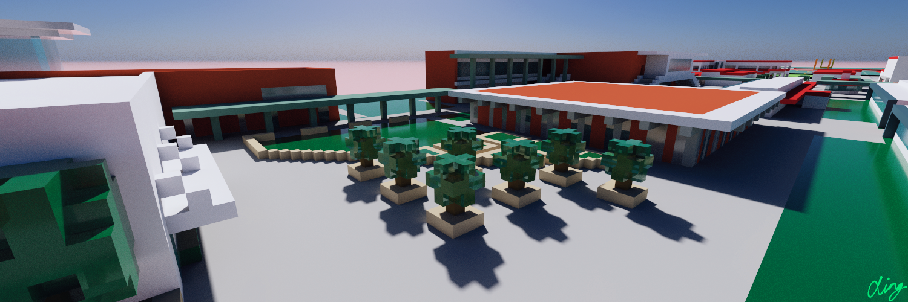

3D voxel map pipeline and viewer for Arcadia High, 
being built and programmed by Xing since 2021, 
with help from Shin, Charles, and many open source libraries.

## How it works

Using the free, proprietary software MagicaVoxel, I am making a 1024 × 256 × 32 voxel model of Arcadia High School
off of satellite imagery and in-person measurements at a resolution of 1 voxel per cubic yard.

I convert the model into a block-by-block representation with the open-source software Goxel, then convert
that into a triangle mesh using a greedy simplification algorithm mentioned by Lysenko and Vercidium. This mesh format
is rasterizable by WebGL, and gives me the base colors of the blocks projected correctly in 3D space.

I also convert the block-by-block representation into a distance field, with each integer coordinate encoding
the taxicab distance to the nearest full block. (When smoothly interpolated, it has the nice side effect of 
providing cheap ambient occlusion.) This distance field allows me to accelerate Xor's raymarching algorithm
to calculate the sharp shadows and reflections which WebGL's rasterizer cannot natively do.

(Both these conversion processes involved a lot of c++. Lots of thanks to Shin for his help here.)

To reduce the compute time of the reflections, I store the screen-space coordinates of the reflected pixels
along with the original pixels in a render buffer, then combine the two in another framebuffer. Both of these
buffers are multisampled so I can antialias in the final framebuffer.

I also generate clouds with procedural noise, and let the Sun and colors of the sky evolve in real-time.
I randomly vary the block normals slightly to give them a rough surface when viewed close-up.

(Note that shadows, clouds, reflections, and rough normals can be selectively disabled by changing the quality constant,
which improves framerate in low-end devices.)

The labels are stored in the App Development Team's Firebase Realtime Database at
[/places](https://db.ahs.app/places.json?print=pretty) and [/placeLists](https://db.ahs.app/placeLists.json?print=pretty).
Their coordinates are mapped with the camera's projectiont matrix onto an HTML canvas overlay,
with opacity controlled by their distance from the camera (a rough estimate of importance)
and the camera's height off the ground (a rough estimate of view distance as I haven't depth-culled them yet).

The gestures are a work in progress. Thanks for Charles for making them acceleration-based for first-person navigation,
but I plan on focusing on a birds-eye view that navigates more like a regular map.

## How to update the map (for AHS App Dev Team members)

1. Edit `maps/map.vox` in MagicaVoxel (get the lastest version from our Discord server)
2. Convert to mesh and texture files with `make all`
3. Set the environmental variable `KEY` as our AES-CBC JSON Web Key, then `make encrypted`
4. Push your changes

## How to update the labels

1. Do it by hand lol
2. I will make an editor for this soonishlyTM

## Long-term to-do list

* 33 × upscaling
* Soft shadows
* Textured surfaces
* Prettier clouds
* Live weather

## Full credits

* 3D model, processing pipeline, labels database, user interface and WebGL renderer: [Xing Liu](https://github.com/FlyOrBoom)
* C++ assistance: [Shin Umeda](https://github.com/DolphinGUI)
* Smooth controls: [Charles Pei](qwertyuioplkjhgfd)
* Voxel traversal: [Xor](https://www.shadertoy.com/view/fstSRH)
* Mesh simplification: [Mikola Lysenko](https://0fps.net/2012/06/30/meshing-in-a-minecraft-game) and [Vercidium](https://vercidium.com/blog/voxel-world-optimisations/)
